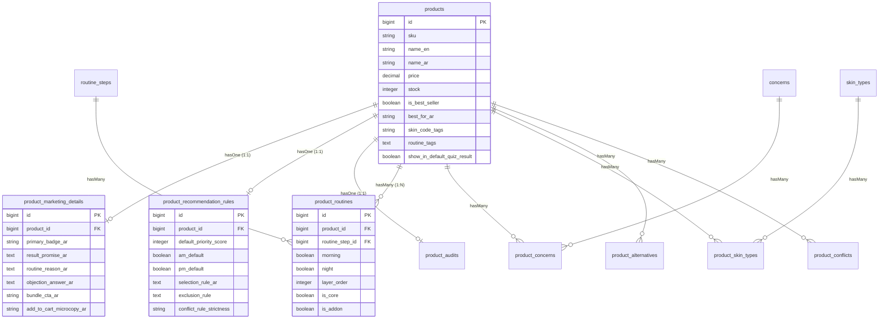

# KCODE Database Architecture & Recommendation Engine Schema

هذا المستند يقدم شرحاً تفصيلياً كاملاً لبنية قاعدة البيانات في مشروع **KCODE**، وكيفية ترابط الجداول الخاصة بالمنتجات، التسويق، خوارزمية الترشيح (Recommendation Engine)، والـ Quiz.

---

## 1. الرسم البياني للعلاقات (Entity-Relationship Diagram)

المخطط التالي يوضح كيفية ترابط جداول قاعدة البيانات ببعضها البعض:

---

## 2. تفصيل الجداول وتصنيفها حسب الغرض والظهور في الموقع

تم تقسيم الجداول في قاعدة بيانات **KCODE** إلى ثلاثة مستويات رئيسية بناءً على غرضها ومكان ظهورها للزائر:

---

### أ. الجداول الظاهرة للمستخدم (Client-Facing - Visible on Website)
هذه الجداول تُعرض بياناتها مباشرة في صفحات المتجر وتؤثر على تجربة الزائر البصرية والشرائية.

#### 1. جدول المنتجات الأساسي (`products`)
* **الغرض:** يحتوي على الهوية الفيزيائية للمنتج (الاسم، السعر، المخزون، الوصف الطويل، والـ SEO).
* **أين يُعرض؟** في صفحة المتجر، صفحة نتائج البحث، وصفحة تفاصيل المنتج (PDP).
* **الأعمدة المضافة حديثاً الخاصة بالـ Quiz:**
  * `best_for_ar`: جملة مختصرة توضح الغرض الأساسي من المنتج (مثال: "تنظيف المسام وتقليل الحبوب") وتظهر تحت اسم المنتج مباشرة.
  * `is_best_seller`: علامة لتحديد المنتجات الأكثر مبيعاً وعرضها أولاً في المتجر.
  * `skin_code_tags`: أكواد البشرة السريعة المستهدفة.
  * `routine_tags`: وسوم تصنيفية سريعة.

#### 2. جدول تفاصيل التسويق (`product_marketing_details`)
* **الغرض:** تقديم نصوص تسويقية مقنعة تجيب على مخاوف العميل وتدفعه للشراء.
* **أين يُعرض؟**
  * **في صفحة تفاصيل المنتج (PDP):** تظهر الشارة (`primary_badge_ar`) فوق صورة المنتج، ووعد النتيجة (`result_promise_ar`) تحت السعر، وحل الاعتراضات (`objection_answer_ar`) فوق زر الإضافة للسلة.
  * **في صفحة اقتراح الروتين (Quiz Result):** يظهر نص "سبب اختيار المنتج لروتينك" (`routine_reason_ar`) بجانب كل منتج مقترح ليعرف العميل فائدته الطبية لحالته الخاصة.

#### 3. جداول التصنيفات والماركات (`categories`, `sub_categories`, `brands`)
* **الغرض:** تقسيم المنتجات لتسهيل التصفح والتصفية (Filter).
* **أين يُعرض؟** في القائمة العلوية للموقع، الفلاتر الجانبية، وصفحة المنتج لتحديد الماركة.

#### 4. جداول التفاعل (`reviews`, `favourites`)
* **الغرض:** تعليقات وتقييمات العملاء وحفظ المنتجات المفضلة.
* **أين يُعرض؟** في صفحة المنتج (التقييمات)، وحساب العميل الشخصي (المفضلة).

---

### ب. الجداول البرمجية لخوارزمية الترشيح (Backend Logic - Hidden)
هذه الجداول لا يراها العميل مباشرة، ولكن الكود البرمجي (Backend) يستعلم منها لبناء روتين مخصص وذكي.

#### 1. جدول قواعد خوارزمية الترشيح (`product_recommendation_rules`)
* **الغرض:** يمثل الدليل الطبي لقواعد محرك الـ Quiz.
* **الفائدة البرمجية:**
  * يحدد أولويات عرض المنتجات المناسبة للبشرة عبر درجات الأولوية (`default_priority_score`).
  * يستبعد المنتجات الطبية التي تتعارض مع العميل (مثال: استبعاد منتجات معينة للحوامل أو ذوي البشرة شديدة الحساسية عبر `exclusion_rule`).
* **هل يظهر للعميل؟** لا، الزائر يرى فقط المنتج النهائي المرشح له.

#### 2. جدول ترتيب الروتين (`product_routines`)
* **الغرض:** تحديد خطوة استخدام المنتج وتوقيتها.
* **الفائدة البرمجية:** يحدد هل المنتج يوضع صباحاً أم مساءً (`morning/night`)، ترتيب وضعه كطبقة (`layer_order`)، وهل هو خطوة أساسية لا غنى عنها (`is_core`) أم خطوة إضافية تكميلية (`is_addon`).

#### 3. جداول الربط والتوافق (`product_skin_types`, `product_concerns`, `product_conflicts`)
* **الغرض:** تحديد توافق المنتجات مع أنواع البشرة، والمشاكل الجلدية، والتعارضات الكيميائية بين المنتجات (مثل عدم وضع ريتينول مع فيتامين سي في نفس الوقت).

---

### ج. جداول الإشراف وضمان الجودة (Admin-Only - Dashboard)
هذه الجداول مخصصة للمشرفين، الصيادلة، ومسؤولي إدخال البيانات في لوحة التحكم لمراجعة سلامة البيانات قبل نشرها للعامة.

#### 1. جدول تدقيق المنتجات (`product_audits`)
* **الغرض:** متابعة جودة مدخلات كل منتج.
* **الفائدة البرمجية:**
  * تعيين المنتجات التي تحتاج مراجعة يدوية وتعديل من الصيدلي قبل تفعيلها للمستخدمين (`needs_manual_check`).
  * تتبع روابط المصادر والملاحظات التقنية للمطورين (`developer_output_rule`).

---

## 3. مثال عملي متكامل (Real-World Example)

دعنا نتتبع منتج **"غسول كوزريكس اللطيف اليومي بحمض الساليسيليك"** وكيف تتوزع بياناته في قاعدة البيانات:

### 1. البيانات الأساسية (`products`)
* **ID:** `45`
* **SKU:** `KCODE-P001`
* **الاسم:** غسول كوزريكس اللطيف اليومي بحمض الساليسيليك
* **السعر:** `18.5` دينار/ريال
* **أفضل لـ (`best_for_ar`):** علاج حب الشباب النشط وتقليل الدهون الزائدة.
* **الأكثر مبيعاً (`is_best_seller`):** `true`
* **أكواد البشرة (`skin_code_tags`):** `OILY, ACNE-PRONE, COMBINATION`

### 2. البيانات التسويقية (`product_marketing_details`)
* **Product ID:** `45`
* **الشارة (`primary_badge_ar`):** الأكثر طلباً للبشرة الدهنية
* **الوعد التسويقي (`result_promise_ar`):** بشرة صافية خالية من الرؤوس السوداء خلال 10 أيام.
* **سبب وضعه بالروتين (`routine_reason_ar`):** تم ترشيح هذا الغسول لتنظيف مسامك بعمق وإزالة الإفرازات الدهنية التي تسبب ظهور الحبوب.
* **الرد على الاعتراضات (`objection_answer_ar`):** يحتوي على نسبة متوازنة من حمض الساليسيليك الفعال دون التسبب في تهيج أو جفاف شديد للبشرة.

### 3. قواعد خوارزمية الترشيح (`product_recommendation_rules`)
* **Product ID:** `45`
* **نقاط الأولوية (`default_priority_score`):** `95`
* **الصباح والمساء:**
  * `am_default`: `true`
  * `pm_default`: `true`
* **شروط الاختيار (`selection_rule_ar`):** يرشح للبشرة الدهنية التي تعاني من حب الشباب أو المسام الواسعة.
* **شروط الاستبعاد (`exclusion_rule`):** يستبعد تماماً إذا كانت البشرة شديدة الجفاف أو مصابة بإكزيما أو متضررة الحاجز الجلدي.

### 4. هيكل الروتين (`product_routines`)
* **Product ID:** `45`
* **الخطوة (`routine_step_id`):** `1` (خطوة الغسول - Cleanser)
* **الوقت:** صباحاً ومساءً (`morning = true, night = true`)
* **ترتيب الطبقة (`layer_order`):** `1` (أول منتج يوضع على البشرة)
* **نوع الخطوة:** أساسي (`is_core = true`)

---

## 4. كيف يستعلم الكود عن هذه البيانات في الـ Quiz؟

عندما يجيب العميل على الـ Quiz بـ: **(بشرتي دهنية، وأعاني من حب الشباب)**:

1. **الخطوة الأولى (التصفية والفلترة):**
   يقوم محرك الترشيح بالاستعلام عن جميع المنتجات المناسبة للبشرة الدهنية والحبوب من خلال جداول الربط (`product_skin_types` و `product_concerns`).
2. **الخطوة الثانية (التحقق من الاستبعاد):**
   يقوم النظام بفحص عمود `exclusion_rule` لكل منتج مرشح للتأكد من عدم وجود موانع استخدام (مثل الحمل أو الحساسية الشديدة).
3. **الخطوة الثالثة (ترتيب الأولويات وكسر التعادل):**
   إذا وجد النظام 3 غسولات مناسبة للبشرة الدهنية والحبوب، يستعلم عن `default_priority_score` من جدول `product_recommendation_rules`. يجد غسول كوزريكس بأولوية `95` والآخرين بأولويات أقل، فيختار كوزريكس ليكون الغسول الأساسي (`is_core`).
4. **الخطوة الرابعة (توليد مخرجات الروتين):**
   يجلب النظام بيانات المنتج الأساسية من جدول `products` (الاسم، السعر، الصورة) ويدمجها مع حقل `routine_reason_ar` من جدول `product_marketing_details` ليعرض للمستخدم النتيجة كالتالي:
   > **الخطوة 1: الغسول اليومي**
   > * **المنتج:** غسول كوزريكس اللطيف اليومي بحمض الساليسيليك.
   > * **السعر:** 18.5
   > * **لماذا اخترناه لك؟** تم ترشيح هذا الغسول لتنظيف مسامك بعمق وإزالة الإفرازات الدهنية التي تسبب ظهور الحبوب.
